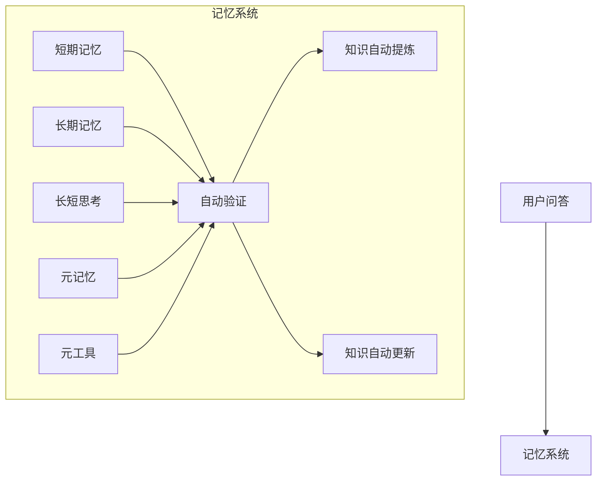
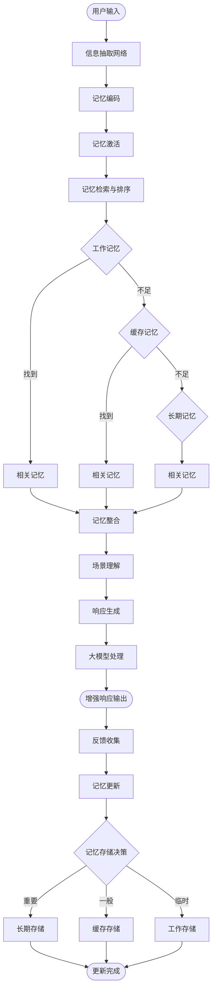
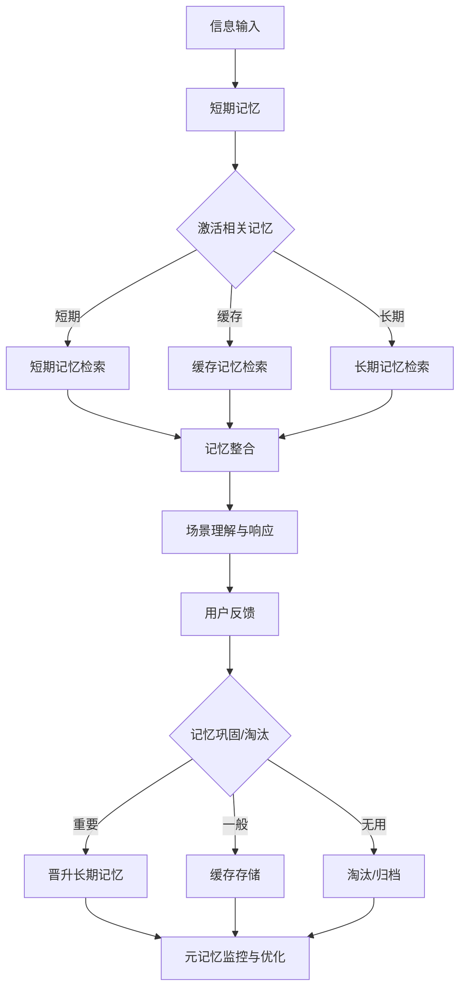
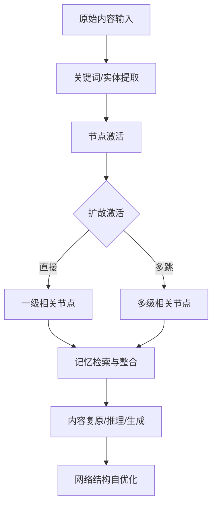
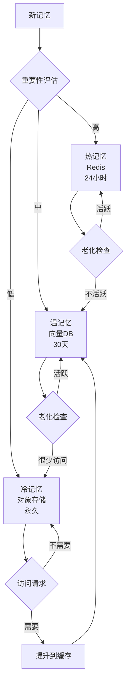
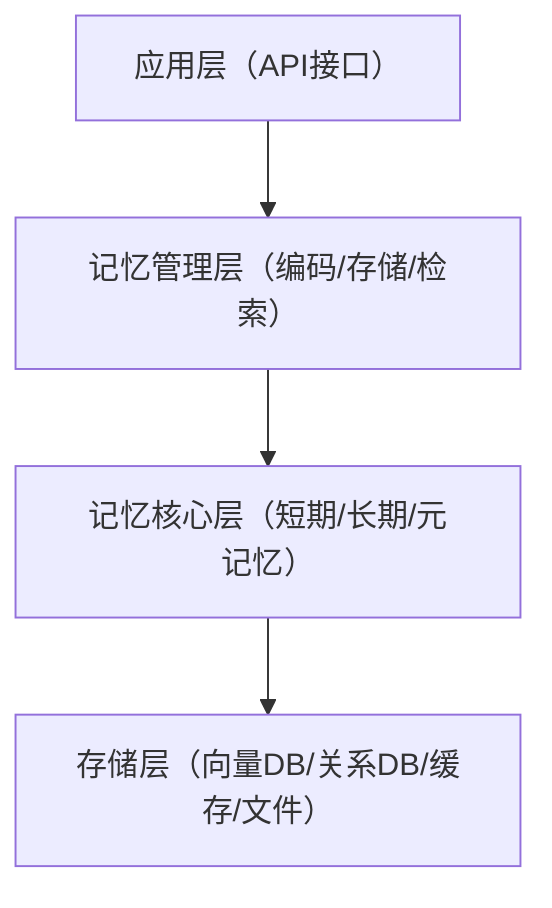

# 记忆智能体构建文档（细化融合版）

## 一、项目概述
- 本系统模拟人脑记忆的编码、存储、检索、巩固与遗忘机制，融合现代AI与知识工程，目标是打造具备"无限记忆"、自我进化、持续学习能力的智能体。
- 适用于智能助手、知识管理、学习系统、决策支持等场景，强调信息的动态流转与自我优化。
- 采用多级存储（短期、长期、元记忆）、联想激活、遗忘与巩固等机制，融合大模型、向量数据库、知识图谱、规则引擎，实现结构化与非结构化知识的统一管理。

---

## 二、系统架构与核心模块

### 架构总览



- **短期记忆**：负责当前任务和对话的上下文缓存，支持多模态输入（文本、语音、图像），具备上下文窗口、注意力机制，能实时响应用户需求。
- **长期记忆**：存储重要知识、经验、技能和历史事件，采用知识图谱、向量数据库等多种存储方式，支持知识的自动分类、主题聚合、历史事件追溯。
- **元记忆**：监控记忆的使用、质量和遗忘，动态调整记忆管理策略，包括自动化内容提取提示词，用于动态生成和优化信息抽取、检索、总结等过程的提示和策略。
- **联想网络**：实现信息的多维度抽取、场景理解和记忆激活，支持多跳扩散激活、模糊检索、情境联想，提升系统的灵活性和创造性。
- **工具记忆**：记录和复用工具链调用、参数和结果，支持自动化推理和复杂任务的自动化解决。
- **自动提炼与更新**：持续优化和进化知识体系。

---

## 三、记忆处理与流转流程

### 整体流程



1. **信息抽取**：从用户输入中提取实体、关系、事件、意图、情感等多维度信息，支持多语言、多模态信息抽取，具备实体消歧、事件归因、上下文理解等能力。
2. **记忆编码**：将抽取的信息进行结构化、向量化和层次化编码，采用多层次嵌入（embedding）、结构化标签、时间戳等多维度编码，便于后续检索和分析。
3. **记忆激活**：根据输入特征、上下文和历史，激活相关记忆，包括直接激活、扩散激活和情境激活，结合语义相似度、结构相似度、情感共鸣等多种激活方式。
4. **记忆检索与排序**：多级检索（工作记忆、缓存、长期记忆），并对结果进行相关性排序。
5. **记忆整合与场景理解**：融合多源记忆，理解当前场景，生成适合的响应。
6. **响应生成与反馈**：基于整合记忆和大模型生成最终响应，并收集用户反馈用于记忆更新，系统可根据用户反馈、任务结果自动修正记忆内容和权重，支持自我进化。
7. **记忆存储决策**：根据重要性和使用频率，决定信息存储在长期、缓存或工作记忆中。

#### 信息压缩与复原
- 系统会自动对对话内容或知识内容进行关键词提取（可按段落或会话粒度），仅存储关键词及其结构化关系，实现高效压缩。
- 需要时，AI可基于关键词自动补全和生成原始内容，最大程度还原原文或原意。
- 复原语义的准确度是衡量信息压缩效果的关键指标，准确度越高，说明压缩保留了更多有效信息。
- 应用场景包括快速回顾历史对话/知识、存储空间优化、智能摘要与知识迁移、语义检索与推理。

### 记忆流转流程图



---

## 记忆流转类型与策略

### 1. 记忆时效/层级
- **短期记忆（Short-term Memory）**：
  - 以会话级别为主，依赖自动摘要、关键词提取和智能复原。
  - 适合快速响应、上下文追踪，内容随会话结束或窗口滑动自动淘汰。
  - 流转后会进行知识提取、工具提取（如学习和验证）。
- **长期记忆（Long-term Memory）**：
  - 经过多次激活或重要性评估后晋升，落地为结构化知识库。
  - 不同类型采用不同结构：
    - 工具型：采用mcp文档方式，形成标准化工具文档。
    - 知识型：采用碎片化知识片段，便于灵活检索和组合。
    - 事件型：采用事件链和因果关系结构，支持事件追溯与推理。

### 2. 记忆类型
- **工具记忆（Tool Memory）**：
  - 记录工具/API调用、参数、结果，流转到长期记忆后以mcp文档标准存储。
  - 支持自动化推理、工具链复用和验证。
- **知识记忆（Knowledge Memory）**：
  - 以碎片化知识片段存储，便于多维度检索和知识迁移。
  - 支持知识点自动归类、主题聚合。
- **事件记忆（Event Memory）**：
  - 采用事件链、因果关系结构，支持复杂事件追溯和推理。
- **情感记忆、场景记忆等**：
  - 记录用户情感、场景上下文，辅助个性化服务和多轮对话。

### 3. 流转、提取与复原策略
- **短期记忆**：
  - 依赖自动摘要、关键词提取，必要时可通过AI智能复原原文。
  - 适合会话级别的快速检索与上下文追踪。
- **记忆流转后**：
  - 进行知识提取（结构化知识片段）、工具提取（标准化工具文档）、事件链提取（因果关系建模）。
- **长期记忆**：
  - 工具型：以mcp文档方式落地，便于自动化调用和验证。
  - 知识型：以碎片化片段存储，支持灵活组合与迁移。
  - 事件型：以事件链、因果关系结构化存储。

### 4. 配置参数建议
- `memory_layer`: ["short_term", "long_term"]
- `memory_type`: ["tool", "knowledge", "event", "emotion", "scenario"]
- `extraction_policy`: ["summary", "keyword", "event_chain", "tool_doc"]
- `restoration_policy`: ["ai_completion", "contextual_restore"]
- `storage_format`: ["mcp_doc", "fragment", "event_chain"]

### 5. 典型配置示例
```python
custom_params = {
    "memory_layer": "short_term",
    "memory_type": "tool",
    "extraction_policy": "summary",
    "restoration_policy": "ai_completion",
    "storage_format": "mcp_doc"
}
memflow_config = build_memflow_config(custom_config=custom_params)
```

---

## 四、联想网络与信息抽取

### 设计理念
- 记忆以高维空间连续分布，支持模糊匹配和近似检索。
- 显式抽取（实体、关系、事件、时空）与隐式推理（意图、情感、因果、含义）结合。
- 信息分为概要、概念、细节等层次，并进行向量化编码。
- 网络结构随使用动态调整，自动发现模式和新概念。

### 主要功能与流程



- 显式信息抽取：识别文本中的实体、关系、事件、时空特征。
- 隐式信息推理：推断用户意图、情感、隐含因果关系等。
- 层次化编码：将信息分为概要、概念、细节等多层次，便于不同粒度的检索。
- 向量化表示：将内容和上下文转为高维向量，支持语义检索和相似度计算。
- 场景识别：根据输入和记忆池特征，识别当前场景并与历史场景融合。
- 记忆激活：通过直接激活、扩散激活（多跳传播、强度递减）、情境激活等方式，激活相关记忆。
- 记忆流管理：动态管理工作记忆、缓存和长期记忆，实现信息的流转、巩固和淘汰。
- 智能预加载：根据上下文和访问模式，预测并预加载可能需要的记忆。
- 显式与隐式信息融合：不仅能抽取显式知识，还能通过推理获得隐含意图、情感、因果关系等深层信息。
- 自组织与涌现机制：系统可自动发现高频模式、形成新概念，支持知识的自我生长和结构优化。
- 多层次检索：支持从粗粒度（主题/事件）到细粒度（事实/细节）的多层次检索，满足不同场景需求。

### 信息压缩与复原
- 联想网络自动对对话或知识内容进行关键词提取，并将这些关键词作为信息压缩的核心载体。
- 通过网络中的节点和关联，系统可基于关键词进行信息补充和内容复原，实现高效的信息压缩与智能还原。
- 复原语义的准确度是衡量信息压缩效果的关键指标。

### 工程实现建议
- 底层可用图数据库（如Neo4j）或自定义高效图结构。
- 节点/边应支持多模态属性和动态权重调整。
- 提供标准API接口，支持节点激活、扩散检索、结构调整等操作。
- 集成网络结构可视化，便于调试与优化。

---

## 五、场景理解与记忆激活

- 系统可自动识别并建模用户当前所处的任务/对话场景，动态调整记忆检索和响应策略。
- 支持历史场景匹配、知识迁移、场景演化与异常检测，提升系统的泛化能力。
- 记忆激活策略结合相关性、结构相似性、情感共鸣等多维度，实现无限记忆。

---

## 六、分层存储与无限记忆

### 分层存储架构



- **热记忆**（Redis，24小时）：高速缓存活跃信息，支持快速访问。
- **温记忆**（向量DB，30天）：存储重要记忆，支持语义检索。
- **冷记忆**（对象存储，永久）：归档历史记忆，按需加载。
- 动态冷热分层策略，结合访问频率、重要性、时效性等多维度动态调整记忆分层，保障高效检索与存储成本平衡。
- 遗忘与巩固机制：模拟人脑遗忘曲线，自动淘汰低价值记忆，通过重复激活和用户反馈巩固高价值记忆。
- 对历史记忆进行语义压缩、结构归档，支持按需恢复和再利用。

### 生命周期管理
- 记忆从创建、活跃、衰减、归档、压缩到恢复和永久保存，动态管理。
- 采用遗忘曲线和重要性评估，自动归档和压缩不常用记忆。

---

## 七、元记忆与自我优化

- 监控记忆质量、遗忘曲线和使用频率，定期评估记忆库的完整性、准确性和冗余度，自动触发优化和清理。
- 根据系统运行效果、用户行为和外部环境，动态调整学习、检索和存储策略。
- 网络结构随使用自动优化，节点和连接动态调整。
- 每次交互都能优化网络结构和增强记忆，支持新知识的增量学习和跨领域知识迁移，提升系统的持续进化能力。

---

## 八、工具记忆与自动化推理

- 记录API、命令、参数、调用链和依赖，便于后续复用。
- 可根据任务需求自动组合和调用多种工具，支持复杂任务的自动化处理。
- 支持显示调用（用户指定）和隐式调用（系统自动选择）。
- 定期验证工具链可用性，记录验证结果和错误信息，自动反馈到工具知识库，提升工具链的智能化水平。
- 基于历史调用和验证结果，自动推理最优工具链，实现自我进化。

---

## 九、技术架构与实现

- **核心框架**：LangChain
- **向量数据库**：ChromaDB / Pinecone / Weaviate
- **语言模型**：OpenAI GPT / Claude / Local LLMs
- **存储层**：PostgreSQL、Redis、对象存储
- **搜索引擎**：Elasticsearch
- **多模态支持**：文本、语音、图像等
- **高可用与可扩展**：微服务、分布式存储和高可用架构，支持大规模并发和弹性扩展。
- **安全与隐私保护**：支持数据加密、访问控制和用户隐私保护，保障系统安全合规。

### 系统分层



### 项目结构建议
```
memory_system/
├── memory_item.py
├── short_term.py
├── long_term.py
├── meta_memory.py
├── pipeline.py
├── extractor/
├── encoder/
├── storage/
├── retrieval/
├── api/
├── tests/
└── ...
```

---

## 十、性能优化与扩展

- 缓存策略（LRU、预测性、分级缓存）、多级索引、并行处理、GPU加速、异步IO，提升检索效率和系统吞吐。
- 记忆压缩（语义和结构压缩）、智能预取与可视化运维工具，降低存储成本，提升响应速度。
- 支持多模态、情感、协作、可视化和隐私保护等扩展功能。

---

## 十一、典型应用场景

- **智能助手**：具备持久记忆和上下文理解能力，持续记忆用户偏好、历史对话，实现个性化服务。
- **知识管理**：构建个人或组织级知识库，自动归档、分类和检索企业知识，支持团队协作和知识共享。
- **学习系统**：辅助学习、知识巩固和经验积累，跟踪学习进度、自动推荐复习内容，辅助知识巩固和能力提升。
- **决策支持**：基于历史经验和知识提供建议，自动生成决策建议和风险预警。

---

## 十二、开发计划

- **第1-2周**：搭建基础框架，实现短期和长期记忆，集成LangChain。
- **第3-4周**：实现记忆编码、存储、检索和知识分类。
- **第5-6周**：开发元记忆系统、记忆网络和检索优化。
- **第7-8周**：性能优化、完善测试和文档。
- **持续迭代**：持续收集用户反馈、系统评估和功能优化，确保系统始终贴合实际需求。
- **开放接口**：提供标准API和SDK，便于第三方集成和生态扩展。
- **文档与培训**：完善开发文档和用户手册，支持团队快速上手和二次开发。

---

## Thirteen. Usage Example

Assuming the package name is `memfusion`, here is a typical usage:

### 1. Import Core Components
```python
from memfusion import ShortMemory, LongMemory, MetaMemory
from memfusion.chain import ParallelChain, SerialChain
from memfusion.memlink import build_memflow_config, default_config, custom_config
```

### 2. Build Memory System Component
```python
# Initialize various memory modules
short_mem = ShortMemory()
long_mem = LongMemory()
meta_mem = MetaMemory()

# Assemble into a memory system component (combine as needed)
memory_system = ParallelChain([
    short_mem,
    long_mem,
    meta_mem
])
```

### 3. Configure Memory Flow
```python
# Use default config
memflow_config = build_memflow_config(default_config)

# Or use custom config
custom_params = {
    # e.g. "activation_strategy": "diffusion_activation",
    #      "retrieval_levels": ["short_term", "long_term"]
}
memflow_config = build_memflow_config(custom_config=custom_params)

# Add memory flow to the system
memory_system.add(memflow_config)
```

### 4. Decorator Usage
```python
@memory_system.mem
def your_function(...):
    # Memory flow and management are automatically integrated here
    ...
```

### 5. Typical Call Flow
```python
# Directly call the decorated function, memory encoding, retrieval, activation, etc. are handled automatically
your_function(input_data)
```

---

For more detailed API documentation or advanced usage, please refer to the module source code or contact the developer.

---

## 附录：数据结构与联想网络节点

### 记忆智能体的数据结构
- **短期记忆**：存储最近输入、上下文和临时推理结果，采用队列/窗口结构和向量化表示，支持多模态数据结构，包含上下文、时间戳、来源等元信息。
- **长期记忆**：存储重要知识、经验和历史事件，采用向量数据库和分层结构，支持知识图谱、事件链、经验总结等多种结构，便于知识的多维度检索和分析。
- **元记忆**：记录记忆的使用频率、遗忘参数、质量评估和检索策略，包含访问日志、反馈记录、遗忘参数、策略调整历史等，支持系统自我优化。
- **工具记忆**：记录API、命令、参数、调用链和依赖，便于后续复用和自动化推理。

### 联想网络节点结构示例
```json
{
  "node_id": "n_001",
  "type": "entity",
  "content": "人工智能",
  "embedding": [0.12, 0.34, ...],
  "modalities": {
    "text": "人工智能",
    "image": "ai.png",
    "audio": null
  },
  "edges": [
    {"target": "n_002", "type": "因果", "weight": 0.8},
    {"target": "n_003", "type": "同义", "weight": 0.6}
  ],
  "last_activated": "2024-06-01T12:00:00Z",
  "importance": 0.9
}
```
- 节点和边应支持多模态属性和动态权重调整，定期根据访问频率、共现关系等自动增删节点/边。
- 提供标准API接口，支持节点激活、扩散检索、结构调整等操作。
- 集成可视化工具，便于网络结构调试与优化。

---

如需进一步细化某一层的存储结构、检索流程或工程实现，请随时告知！

---

### 逻辑推理模块

#### 核心功能
- 管理基本逻辑结构和推理规则
- 支持知识的结构化表达和自动推理
- 实现复杂查询和多跳推理

#### 主要逻辑类型
- **关系逻辑**：实体间的关系建模（如：父子关系、因果关系）
- **规则逻辑**：条件推理规则（如：如果A则B）
- **图逻辑**：网络结构推理（如：社交网络、知识图谱）

#### 应用场景
- 知识图谱构建与查询
- 自动推理与问答
- 复杂关系分析

#### 简化示例
```json
{
  "rule_id": "r001",
  "type": "if_then",
  "condition": "是人类",
  "conclusion": "会死亡",
  "confidence": 0.95
}
```

--- 