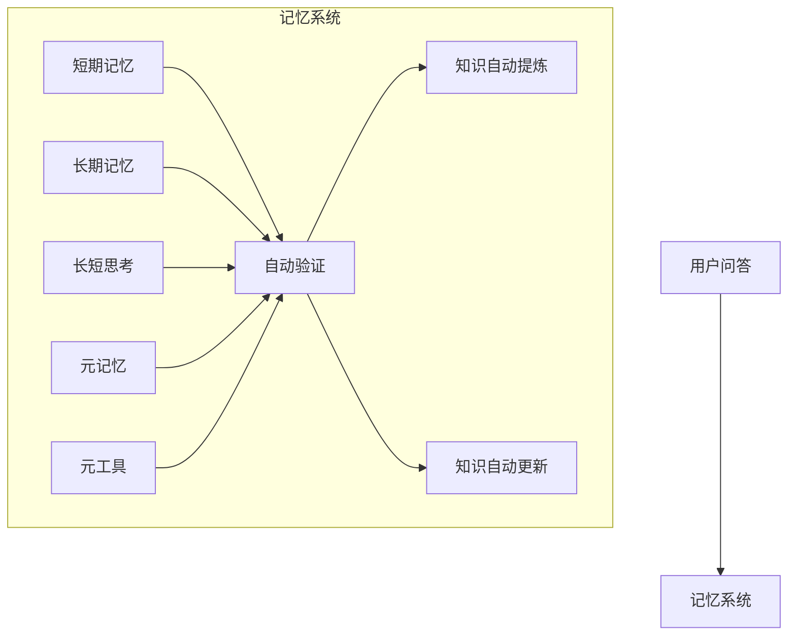
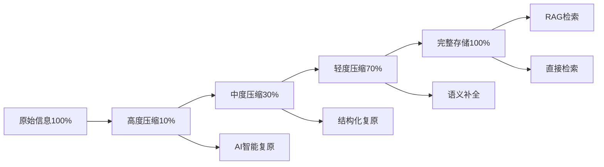
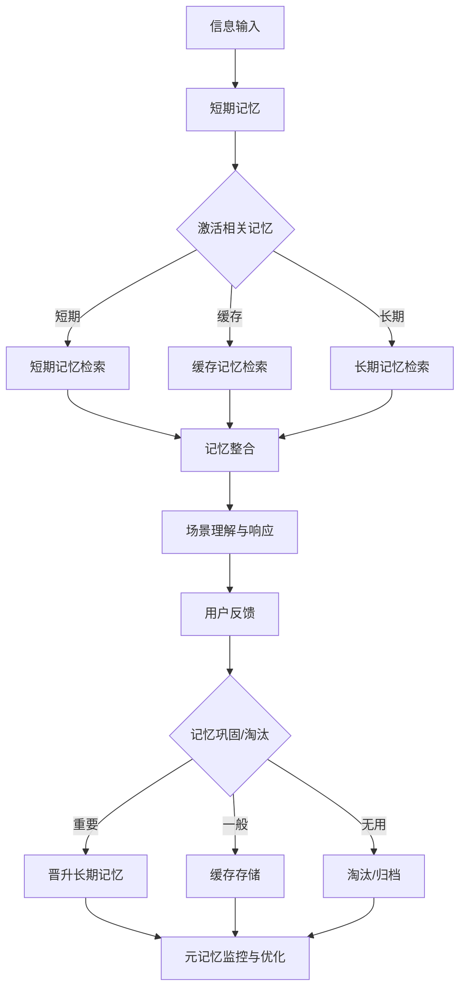
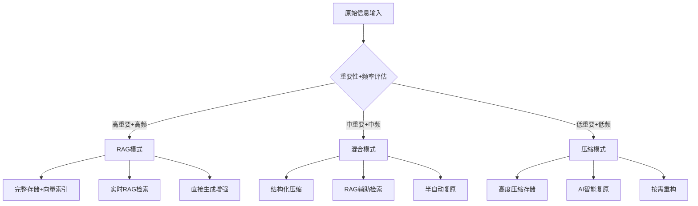
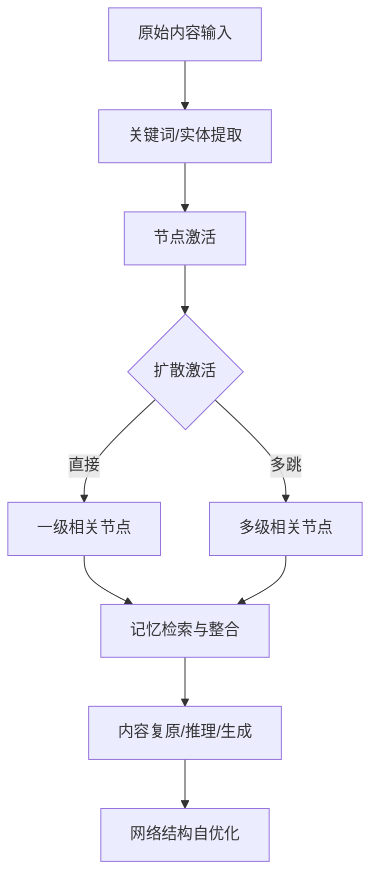
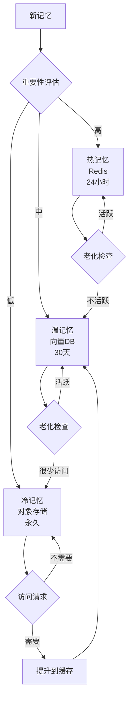
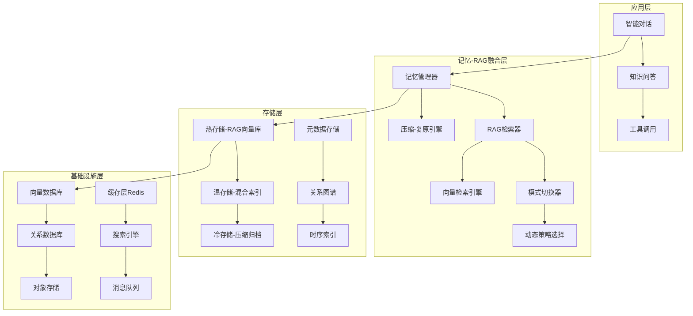
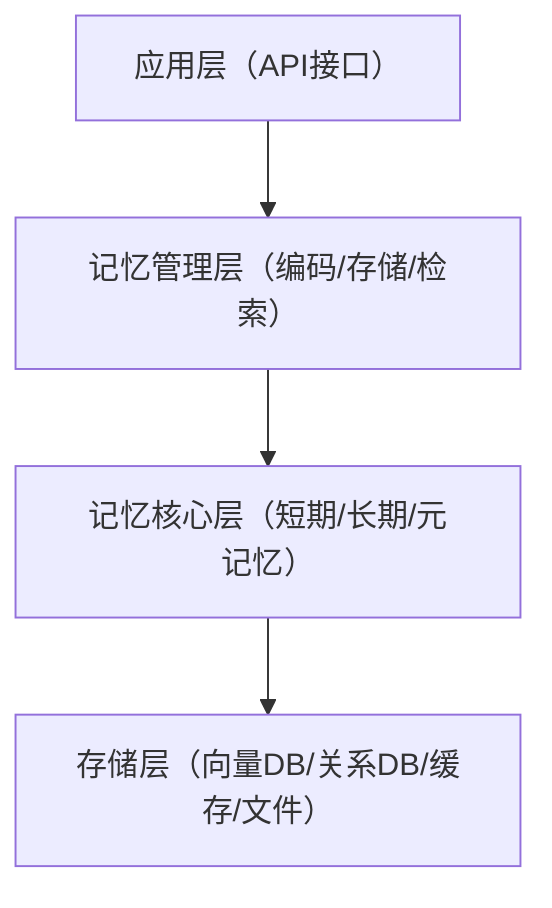

# 记忆智能体构建文档（细化融合版）

## 一、项目概述
- 本系统模拟人脑记忆的编码、存储、检索、巩固与遗忘机制，融合现代AI与知识工程，目标是打造具备"无限记忆"、自我进化、持续学习能力的智能体。
- 适用于智能助手、知识管理、学习系统、决策支持等场景，强调信息的动态流转与自我优化。
- 采用多级存储（短期、长期、元记忆）、联想激活、遗忘与巩固等机制，融合大模型、向量数据库、知识图谱、规则引擎，实现结构化与非结构化知识的统一管理。

---

## 二、系统架构与核心模块

### 架构总览



- **短期记忆**：负责当前任务和对话的上下文缓存，支持多模态输入（文本、语音、图像），具备上下文窗口、注意力机制，能实时响应用户需求。
- **长期记忆**：存储重要知识、经验、技能和历史事件，采用知识图谱、向量数据库等多种存储方式，支持知识的自动分类、主题聚合、历史事件追溯。
- **元记忆**：监控记忆的使用、质量和遗忘，动态调整记忆管理策略，包括自动化内容提取提示词，用于动态生成和优化信息抽取、检索、总结等过程的提示和策略。
- **联想网络**：实现信息的多维度抽取、场景理解和记忆激活，支持多跳扩散激活、模糊检索、情境联想，提升系统的灵活性和创造性。
- **工具记忆**：记录和复用工具链调用、参数和结果，支持自动化推理和复杂任务的自动化解决。
- **自动提炼与更新**：持续优化和进化知识体系。

---

## 三、记忆处理与流转流程

### 整体流程


1. **信息抽取**：从用户输入中提取实体、关系、事件、意图、情感等多维度信息，支持多语言、多模态信息抽取，具备实体消歧、事件归因、上下文理解等能力。
2. **记忆编码**：将抽取的信息进行结构化、向量化和层次化编码，采用多层次嵌入（embedding）、结构化标签、时间戳等多维度编码，便于后续检索和分析。
3. **记忆激活**：根据输入特征、上下文和历史，激活相关记忆，包括直接激活、扩散激活和情境激活，结合语义相似度、结构相似度、情感共鸣等多种激活方式。
4. **记忆检索与排序**：多级检索（工作记忆、缓存、长期记忆），并对结果进行相关性排序。
5. **记忆整合与场景理解**：融合多源记忆，理解当前场景，生成适合的响应。
6. **响应生成与反馈**：基于整合记忆和大模型生成最终响应，并收集用户反馈用于记忆更新，系统可根据用户反馈、任务结果自动修正记忆内容和权重，支持自我进化。
7. **记忆存储决策**：根据重要性和使用频率，决定信息存储在长期、缓存或工作记忆中。

#### 信息压缩与复原（记忆-RAG融合机制）

##### 压缩-复原连续谱


- **0-30%压缩率（高压缩）**：关键词+概念图，依赖AI智能复原
- **30-70%压缩率（中压缩）**：结构化摘要+关系链，半自动复原
- **70-90%压缩率（轻压缩）**：详细摘要+元数据，语义补全
- **90-100%存储率（RAG模式）**：完整文档存储，直接检索增强

##### 融合RAG的记忆处理策略

###### 1. 分层存储与检索策略
- **热记忆层（RAG模式）**：完整存储，向量检索，实时增强
- **温记忆层（混合模式）**：结构化压缩+RAG检索，按需复原
- **冷记忆层（压缩模式）**：高度压缩，AI复原，成本优化

###### 2. 动态压缩-检索决策
```python
def decide_storage_strategy(content, importance, access_frequency):
    if importance > 0.8 and access_frequency > 0.7:
        return "RAG_mode"  # 完整存储+向量检索
    elif importance > 0.5:
        return "hybrid_mode"  # 结构化压缩+检索增强
    else:
        return "compress_mode"  # 高度压缩+AI复原
```

###### 3. RAG增强的记忆复原
- **检索增强复原**：结合相似文档进行内容重构
- **上下文感知复原**：利用RAG检索的相关信息补全语义
- **多源融合复原**：整合压缩记忆+RAG检索+实时信息

##### 技术实现融合

###### 向量化存储策略
- **完整向量化（RAG）**：原文分块+embedding存储
- **压缩向量化**：关键信息+概念向量
- **混合向量化**：多粒度向量表示

###### 检索增强机制
- **语义检索**：基于向量相似度的RAG检索
- **结构检索**：基于知识图谱的关系检索  
- **混合检索**：语义+结构+时间的多维检索

###### 生成增强策略
- **直接生成**：基于完整RAG文档生成
- **复原生成**：基于压缩信息+检索增强生成
- **融合生成**：压缩记忆+RAG检索+实时推理

##### 应用场景与效果
- **实时对话**：RAG模式，完整上下文，高质量响应
- **历史回顾**：混合模式，快速检索+智能复原
- **长期存储**：压缩模式，成本优化+按需复原
- **知识管理**：多模式并存，灵活切换策略

### 记忆流转流程图



---

## 记忆流转类型与策略

### 1. 记忆时效/层级
- **短期记忆（Short-term Memory）**：
  - 以会话级别为主，依赖自动摘要、关键词提取和智能复原。
  - 适合快速响应、上下文追踪，内容随会话结束或窗口滑动自动淘汰。
  - 流转后会进行知识提取、工具提取（如学习和验证）。
- **长期记忆（Long-term Memory）**：
  - 经过多次激活或重要性评估后晋升，落地为结构化知识库。
  - 不同类型采用不同结构：
    - 工具型：采用mcp文档方式，形成标准化工具文档。
    - 知识型：采用碎片化知识片段，便于灵活检索和组合。
    - 事件型：采用事件链和因果关系结构，支持事件追溯与推理。

### 2. 记忆类型
- **工具记忆（Tool Memory）**：
  - 记录工具/API调用、参数、结果，流转到长期记忆后以mcp文档标准存储。
  - 支持自动化推理、工具链复用和验证。
- **知识记忆（Knowledge Memory）**：
  - 以碎片化知识片段存储，便于多维度检索和知识迁移。
  - 支持知识点自动归类、主题聚合。
- **事件记忆（Event Memory）**：
  - 采用事件链、因果关系结构，支持复杂事件追溯和推理。
- **情感记忆、场景记忆等**：
  - 记录用户情感、场景上下文，辅助个性化服务和多轮对话。

### 3. 流转、提取与复原策略（记忆-RAG融合）

#### 记忆处理连续谱策略


#### 分层处理策略

##### **短期记忆（会话级RAG）**
- **RAG模式**：完整对话历史+实时向量检索
- **混合模式**：关键信息摘要+上下文RAG增强
- **压缩模式**：关键词提取+AI智能复原
- 适合会话级别的快速检索与上下文追踪

##### **记忆流转处理**
- **知识提取**：
  - RAG模式：完整知识片段+语义向量
  - 混合模式：结构化知识+检索增强
  - 压缩模式：概念关系图+AI复原
  
- **工具提取**：
  - RAG模式：完整MCP文档+向量检索
  - 混合模式：标准化模板+参数补全
  - 压缩模式：工具签名+使用示例

- **事件链提取**：
  - RAG模式：完整事件序列+时序检索
  - 混合模式：因果关系链+上下文增强
  - 压缩模式：关键节点+推理重构

##### **长期记忆（分层RAG存储）**
- **工具型记忆**：
  - 热存储：MCP文档+向量索引，支持实时RAG检索
  - 温存储：工具模板+参数映射，RAG辅助调用
  - 冷存储：工具签名+压缩描述，AI复原调用

- **知识型记忆**：
  - 热存储：完整知识图谱+向量检索，RAG增强推理
  - 温存储：结构化片段+语义链接，混合检索
  - 冷存储：概念压缩+关系映射，智能重构

- **事件型记忆**：
  - 热存储：完整事件链+时序索引，RAG时序推理
  - 温存储：关键事件+因果关系，结构化检索
  - 冷存储：事件摘要+关系图，推理重建

### 4. 配置参数建议（记忆-RAG融合）
- `memory_layer`: ["short_term", "long_term", "meta_memory"]
- `memory_type`: ["tool", "knowledge", "event", "emotion", "scenario"]
- `processing_mode`: ["rag_mode", "hybrid_mode", "compress_mode"]
- `compression_ratio`: [0.1, 0.3, 0.7, 1.0]  # 压缩比例，1.0为RAG完整存储
- `extraction_policy`: ["summary", "keyword", "event_chain", "tool_doc", "rag_chunk"]
- `restoration_policy`: ["ai_completion", "contextual_restore", "rag_enhanced", "hybrid_restore"]
- `storage_format`: ["mcp_doc", "fragment", "event_chain", "vector_store"]
- `retrieval_strategy`: ["semantic", "structural", "temporal", "hybrid"]
- `rag_config`: {
    "chunk_size": 512,
    "overlap": 50,
    "embedding_model": "text-embedding-3-large",
    "vector_db": "chromadb"
}

### 5. 典型配置示例（记忆-RAG融合）

#### RAG模式配置（高重要性信息）
```python
rag_mode_params = {
    "memory_layer": "long_term",
    "memory_type": "knowledge",
    "processing_mode": "rag_mode",
    "compression_ratio": 1.0,
    "extraction_policy": "rag_chunk",
    "restoration_policy": "rag_enhanced",
    "storage_format": "vector_store",
    "retrieval_strategy": "semantic",
    "rag_config": {
        "chunk_size": 512,
        "overlap": 50,
        "embedding_model": "text-embedding-3-large",
        "top_k": 5,
        "similarity_threshold": 0.7
    }
}
```

#### 混合模式配置（中等重要性信息）
```python
hybrid_mode_params = {
    "memory_layer": "long_term",
    "memory_type": "tool",
    "processing_mode": "hybrid_mode",
    "compression_ratio": 0.7,
    "extraction_policy": "tool_doc",
    "restoration_policy": "hybrid_restore",
    "storage_format": "mcp_doc",
    "retrieval_strategy": "hybrid",
    "rag_config": {
        "chunk_size": 256,
        "enable_rag_fallback": True,
        "compression_threshold": 0.5
    }
}
```

#### 压缩模式配置（低重要性信息）
```python
compress_mode_params = {
    "memory_layer": "short_term",
    "memory_type": "event",
    "processing_mode": "compress_mode",
    "compression_ratio": 0.1,
    "extraction_policy": "keyword",
    "restoration_policy": "ai_completion",
    "storage_format": "fragment",
    "retrieval_strategy": "structural",
    "compression_config": {
        "key_concept_ratio": 0.1,
        "relation_preservation": True,
        "ai_restoration_model": "gpt-4"
    }
}
```

#### 动态模式切换配置
```python
adaptive_params = {
    "mode_selection": "adaptive",
    "importance_threshold": {
        "rag_mode": 0.8,
        "hybrid_mode": 0.5,
        "compress_mode": 0.0
    },
    "frequency_threshold": {
        "rag_mode": 0.7,
        "hybrid_mode": 0.3,
        "compress_mode": 0.0
    },
    "cost_optimization": True,
    "performance_monitoring": True
}

memflow_config = build_memflow_config(
    custom_config=adaptive_params,
    enable_rag_integration=True
)
```

---

## 四、联想网络与信息抽取

### 设计理念
- 记忆以高维空间连续分布，支持模糊匹配和近似检索。
- 显式抽取（实体、关系、事件、时空）与隐式推理（意图、情感、因果、含义）结合。
- 信息分为概要、概念、细节等层次，并进行向量化编码。
- 网络结构随使用动态调整，自动发现模式和新概念。

### 主要功能与流程



- 显式信息抽取：识别文本中的实体、关系、事件、时空特征。
- 隐式信息推理：推断用户意图、情感、隐含因果关系等。
- 层次化编码：将信息分为概要、概念、细节等多层次，便于不同粒度的检索。
- 向量化表示：将内容和上下文转为高维向量，支持语义检索和相似度计算。
- 场景识别：根据输入和记忆池特征，识别当前场景并与历史场景融合。
- 记忆激活：通过直接激活、扩散激活（多跳传播、强度递减）、情境激活等方式，激活相关记忆。
- 记忆流管理：动态管理工作记忆、缓存和长期记忆，实现信息的流转、巩固和淘汰。
- 智能预加载：根据上下文和访问模式，预测并预加载可能需要的记忆。
- 显式与隐式信息融合：不仅能抽取显式知识，还能通过推理获得隐含意图、情感、因果关系等深层信息。
- 自组织与涌现机制：系统可自动发现高频模式、形成新概念，支持知识的自我生长和结构优化。
- 多层次检索：支持从粗粒度（主题/事件）到细粒度（事实/细节）的多层次检索，满足不同场景需求。

### 信息压缩与复原
- 联想网络自动对对话或知识内容进行关键词提取，并将这些关键词作为信息压缩的核心载体。
- 通过网络中的节点和关联，系统可基于关键词进行信息补充和内容复原，实现高效的信息压缩与智能还原。
- 复原语义的准确度是衡量信息压缩效果的关键指标。

### 工程实现建议
- 底层可用图数据库（如Neo4j）或自定义高效图结构。
- 节点/边应支持多模态属性和动态权重调整。
- 提供标准API接口，支持节点激活、扩散检索、结构调整等操作。
- 集成网络结构可视化，便于调试与优化。

---

## 五、场景理解与记忆激活

- 系统可自动识别并建模用户当前所处的任务/对话场景，动态调整记忆检索和响应策略。
- 支持历史场景匹配、知识迁移、场景演化与异常检测，提升系统的泛化能力。
- 记忆激活策略结合相关性、结构相似性、情感共鸣等多维度，实现无限记忆。

---

## 六、分层存储与无限记忆

### 分层存储架构



- **热记忆**（Redis，24小时）：高速缓存活跃信息，支持快速访问。
- **温记忆**（向量DB，30天）：存储重要记忆，支持语义检索。
- **冷记忆**（对象存储，永久）：归档历史记忆，按需加载。
- 动态冷热分层策略，结合访问频率、重要性、时效性等多维度动态调整记忆分层，保障高效检索与存储成本平衡。
- 遗忘与巩固机制：模拟人脑遗忘曲线，自动淘汰低价值记忆，通过重复激活和用户反馈巩固高价值记忆。
- 对历史记忆进行语义压缩、结构归档，支持按需恢复和再利用。

### 生命周期管理
- 记忆从创建、活跃、衰减、归档、压缩到恢复和永久保存，动态管理。
- 采用遗忘曲线和重要性评估，自动归档和压缩不常用记忆。

---

## 七、元记忆与自我优化

- 监控记忆质量、遗忘曲线和使用频率，定期评估记忆库的完整性、准确性和冗余度，自动触发优化和清理。
- 根据系统运行效果、用户行为和外部环境，动态调整学习、检索和存储策略。
- 网络结构随使用自动优化，节点和连接动态调整。
- 每次交互都能优化网络结构和增强记忆，支持新知识的增量学习和跨领域知识迁移，提升系统的持续进化能力。

---

## 八、工具记忆与自动化推理

- 记录API、命令、参数、调用链和依赖，便于后续复用。
- 可根据任务需求自动组合和调用多种工具，支持复杂任务的自动化处理。
- 支持显示调用（用户指定）和隐式调用（系统自动选择）。
- 定期验证工具链可用性，记录验证结果和错误信息，自动反馈到工具知识库，提升工具链的智能化水平。
- 基于历史调用和验证结果，自动推理最优工具链，实现自我进化。

---

## 九、技术架构与实现（记忆-RAG融合架构）

### 核心技术栈
- **记忆框架**：LangChain + 自研记忆管理层
- **RAG引擎**：LlamaIndex / LangChain RAG + 自适应检索
- **向量数据库**：ChromaDB / Pinecone / Weaviate / Qdrant
- **语言模型**：OpenAI GPT / Claude / Local LLMs
- **存储层**：PostgreSQL、Redis、对象存储、图数据库
- **搜索引擎**：Elasticsearch + 语义搜索
- **多模态支持**：文本、语音、图像、视频等
- **高可用与可扩展**：微服务、分布式存储和高可用架构

### 记忆-RAG融合架构



### 关键组件设计

#### 1. 记忆-RAG融合管理器
```python
class MemoryRAGManager:
    def __init__(self):
        self.rag_engine = RAGEngine()
        self.compression_engine = CompressionEngine()
        self.strategy_selector = StrategySelector()
    
    def process_memory(self, content, metadata):
        # 动态选择处理模式
        mode = self.strategy_selector.select_mode(content, metadata)
        
        if mode == "rag_mode":
            return self.rag_engine.store_and_index(content)
        elif mode == "hybrid_mode":
            compressed = self.compression_engine.compress(content, ratio=0.7)
            return self.rag_engine.store_hybrid(compressed, content)
        else:  # compress_mode
            return self.compression_engine.compress(content, ratio=0.1)
    
    def retrieve_memory(self, query, mode="auto"):
        if mode == "rag_mode":
            return self.rag_engine.retrieve(query)
        elif mode == "hybrid_mode":
            results = self.rag_engine.retrieve(query)
            return self.compression_engine.restore(results)
        else:
            compressed_results = self.retrieve_compressed(query)
            return self.compression_engine.ai_restore(compressed_results)
```

#### 2. 自适应RAG检索器
```python
class AdaptiveRAGRetriever:
    def __init__(self):
        self.vector_store = VectorStore()
        self.graph_store = GraphStore()
        self.temporal_index = TemporalIndex()
    
    def retrieve(self, query, strategy="adaptive"):
        if strategy == "semantic":
            return self.vector_store.similarity_search(query)
        elif strategy == "structural":
            return self.graph_store.graph_search(query)
        elif strategy == "temporal":
            return self.temporal_index.time_aware_search(query)
        else:  # adaptive
            # 多策略融合检索
            semantic_results = self.vector_store.similarity_search(query)
            structural_results = self.graph_store.graph_search(query)
            return self.merge_results(semantic_results, structural_results)
```

#### 3. 智能压缩-复原引擎
```python
class CompressionRestorationEngine:
    def __init__(self):
        self.keyword_extractor = KeywordExtractor()
        self.concept_mapper = ConceptMapper()
        self.ai_restorer = AIRestorer()
    
    def compress(self, content, ratio=0.3):
        if ratio >= 0.7:  # 轻度压缩
            return self.extract_summary(content)
        elif ratio >= 0.3:  # 中度压缩
            keywords = self.keyword_extractor.extract(content)
            concepts = self.concept_mapper.map(keywords)
            return {"keywords": keywords, "concepts": concepts}
        else:  # 高度压缩
            key_concepts = self.extract_key_concepts(content, ratio)
            return {"key_concepts": key_concepts, "relations": self.extract_relations(key_concepts)}
    
    def restore(self, compressed_data, context=None):
        if "summary" in compressed_data:
            return self.expand_summary(compressed_data["summary"], context)
        elif "keywords" in compressed_data:
            return self.ai_restorer.restore_from_keywords(compressed_data, context)
        else:  # key_concepts
            return self.ai_restorer.restore_from_concepts(compressed_data, context)
```

### 性能优化策略

#### 1. 分层缓存策略
- **L1缓存（内存）**：最近访问的RAG结果
- **L2缓存（Redis）**：热点查询的压缩结果
- **L3缓存（向量DB）**：语义相似查询的预计算结果

#### 2. 智能预加载
- 基于访问模式预测，提前加载可能需要的记忆
- 根据用户行为，预先进行RAG检索和结果缓存

#### 3. 成本优化
- 动态调整压缩比例，平衡存储成本和检索质量
- 智能归档策略，将冷数据迁移到低成本存储

### 安全与隐私保护
- **数据加密**：向量数据和压缩数据的端到端加密
- **访问控制**：基于角色的记忆访问权限管理
- **隐私保护**：敏感信息的差分隐私处理
- **审计日志**：完整的记忆访问和操作日志

### 系统分层



### 项目结构建议
```
memory_system/
├── memory_item.py
├── short_term.py
├── long_term.py
├── meta_memory.py
├── pipeline.py
├── extractor/
├── encoder/
├── storage/
├── retrieval/
├── api/
├── tests/
└── ...
```

---

## 十、性能优化与扩展

- 缓存策略（LRU、预测性、分级缓存）、多级索引、并行处理、GPU加速、异步IO，提升检索效率和系统吞吐。
- 记忆压缩（语义和结构压缩）、智能预取与可视化运维工具，降低存储成本，提升响应速度。
- 支持多模态、情感、协作、可视化和隐私保护等扩展功能。

---

## 十一、典型应用场景（记忆-RAG融合应用）

### 1. 智能助手（个性化RAG增强）
- **记忆模式**：
  - 热记忆：用户偏好、常用指令（RAG模式，实时检索）
  - 温记忆：历史对话摘要（混合模式，结构化+RAG）
  - 冷记忆：历史交互记录（压缩模式，AI复原）
- **应用效果**：
  - 个性化服务：基于完整用户画像的RAG检索
  - 上下文连续：跨会话的记忆延续和智能复原
  - 成本优化：根据重要性动态调整存储策略

### 2. 知识管理（企业级RAG知识库）
- **记忆模式**：
  - 核心知识：完整RAG存储，支持精确检索和推理
  - 项目文档：结构化压缩+RAG增强，快速检索关键信息
  - 历史资料：高度压缩存储，按需AI复原
- **应用效果**：
  - 知识检索：多模态RAG检索，支持语义、结构、时序查询
  - 知识传承：压缩存储历史经验，智能复原关键信息
  - 协作共享：分层权限的记忆共享和RAG增强

### 3. 学习系统（自适应教育RAG）
- **记忆模式**：
  - 核心概念：RAG模式存储，支持概念关联和推理
  - 学习进度：混合模式，结构化跟踪+智能分析
  - 练习历史：压缩存储，模式识别和趋势分析
- **应用效果**：
  - 个性化学习：基于学习记忆的RAG推荐系统
  - 知识巩固：智能复习提醒和知识点关联
  - 学习分析：压缩数据的模式挖掘和预测

### 4. 决策支持（智能决策RAG系统）
- **记忆模式**：
  - 决策案例：完整RAG存储，支持案例检索和类比推理
  - 经验总结：结构化压缩，快速匹配相似情况
  - 历史数据：压缩归档，趋势分析和模式识别
- **应用效果**：
  - 决策建议：基于历史案例的RAG增强推理
  - 风险预警：压缩数据的模式识别和异常检测
  - 经验传承：智能复原历史决策过程和思路

### 5. 创意设计（灵感RAG网络）
- **记忆模式**：
  - 设计作品：RAG模式，支持视觉和语义检索
  - 创意片段：混合压缩，保留核心创意要素
  - 灵感记录：高度压缩，AI复原创意思路
- **应用效果**：
  - 灵感检索：多模态RAG检索，发现创意关联
  - 创意组合：压缩要素的智能重组和变异
  - 风格学习：RAG增强的风格迁移和创新

### 6. 科研助手（学术RAG平台）
- **记忆模式**：
  - 核心文献：完整RAG存储，支持精确引用和推理
  - 研究笔记：结构化压缩，保留关键观点和关联
  - 实验数据：压缩存储，模式挖掘和趋势分析
- **应用效果**：
  - 文献综述：RAG增强的文献检索和关联分析
  - 假设生成：基于压缩知识的创新假设推理
  - 研究协作：分层记忆的团队知识共享

### 记忆-RAG融合的核心优势

#### 1. 成本效益优化
- **存储成本**：根据重要性动态调整存储策略
- **计算成本**：智能选择检索vs复原策略
- **时间成本**：分层缓存和预测性加载

#### 2. 质量保证机制
- **准确性**：RAG模式保证关键信息的完整性
- **一致性**：混合模式平衡压缩和准确性
- **可恢复性**：AI复原保证信息的可用性

#### 3. 灵活性与扩展性
- **模式切换**：根据场景动态调整处理模式
- **策略优化**：基于使用反馈持续优化策略
- **技术演进**：支持新的压缩和检索技术集成

---

## 十二、开发计划

- **第1-2周**：搭建基础框架，实现短期和长期记忆，集成LangChain。
- **第3-4周**：实现记忆编码、存储、检索和知识分类。
- **第5-6周**：开发元记忆系统、记忆网络和检索优化。
- **第7-8周**：性能优化、完善测试和文档。
- **持续迭代**：持续收集用户反馈、系统评估和功能优化，确保系统始终贴合实际需求。
- **开放接口**：提供标准API和SDK，便于第三方集成和生态扩展。
- **文档与培训**：完善开发文档和用户手册，支持团队快速上手和二次开发。

---

## Thirteen. Usage Example

Assuming the package name is `memfusion`, here is a typical usage:

### 1. Import Core Components
```python
from memfusion import ShortMemory, LongMemory, MetaMemory
from memfusion.chain import ParallelChain, SerialChain
from memfusion.memlink import build_memflow_config, default_config, custom_config
```

### 2. Build Memory System Component
```python
# Initialize various memory modules
short_mem = ShortMemory()
long_mem = LongMemory()
meta_mem = MetaMemory()

# Assemble into a memory system component (combine as needed)
memory_system = ParallelChain([
    short_mem,
    long_mem,
    meta_mem
])
```

### 3. Configure Memory Flow
```python
# Use default config
memflow_config = build_memflow_config(default_config)

# Or use custom config
custom_params = {
    # e.g. "activation_strategy": "diffusion_activation",
    #      "retrieval_levels": ["short_term", "long_term"]
}
memflow_config = build_memflow_config(custom_config=custom_params)

# Add memory flow to the system
memory_system.add(memflow_config)
```

### 4. Decorator Usage
```python
@memory_system.mem
def your_function(...):
    # Memory flow and management are automatically integrated here
    ...
```

### 5. Typical Call Flow
```python
# Directly call the decorated function, memory encoding, retrieval, activation, etc. are handled automatically
your_function(input_data)
```

---

For more detailed API documentation or advanced usage, please refer to the module source code or contact the developer.

---

## 附录：数据结构与联想网络节点

### 记忆智能体的数据结构
- **短期记忆**：存储最近输入、上下文和临时推理结果，采用队列/窗口结构和向量化表示，支持多模态数据结构，包含上下文、时间戳、来源等元信息。
- **长期记忆**：存储重要知识、经验和历史事件，采用向量数据库和分层结构，支持知识图谱、事件链、经验总结等多种结构，便于知识的多维度检索和分析。
- **元记忆**：记录记忆的使用频率、遗忘参数、质量评估和检索策略，包含访问日志、反馈记录、遗忘参数、策略调整历史等，支持系统自我优化。
- **工具记忆**：记录API、命令、参数、调用链和依赖，便于后续复用和自动化推理。

### 联想网络节点结构示例
```json
{
  "node_id": "n_001",
  "type": "entity",
  "content": "人工智能",
  "embedding": [0.12, 0.34, ...],
  "modalities": {
    "text": "人工智能",
    "image": "ai.png",
    "audio": null
  },
  "edges": [
    {"target": "n_002", "type": "因果", "weight": 0.8},
    {"target": "n_003", "type": "同义", "weight": 0.6}
  ],
  "last_activated": "2024-06-01T12:00:00Z",
  "importance": 0.9
}
```
- 节点和边应支持多模态属性和动态权重调整，定期根据访问频率、共现关系等自动增删节点/边。
- 提供标准API接口，支持节点激活、扩散检索、结构调整等操作。
- 集成可视化工具，便于网络结构调试与优化。

---

如需进一步细化某一层的存储结构、检索流程或工程实现，请随时告知！

---

### 逻辑推理模块

#### 核心功能
- 管理基本逻辑结构和推理规则
- 支持知识的结构化表达和自动推理
- 实现复杂查询和多跳推理

#### 主要逻辑类型
- **关系逻辑**：实体间的关系建模（如：父子关系、因果关系）
- **规则逻辑**：条件推理规则（如：如果A则B）
- **图逻辑**：网络结构推理（如：社交网络、知识图谱）

#### 应用场景
- 知识图谱构建与查询
- 自动推理与问答
- 复杂关系分析

#### 简化示例
```json
{
  "rule_id": "r001",
  "type": "if_then",
  "condition": "是人类",
  "conclusion": "会死亡",
  "confidence": 0.95
}
```

--- 