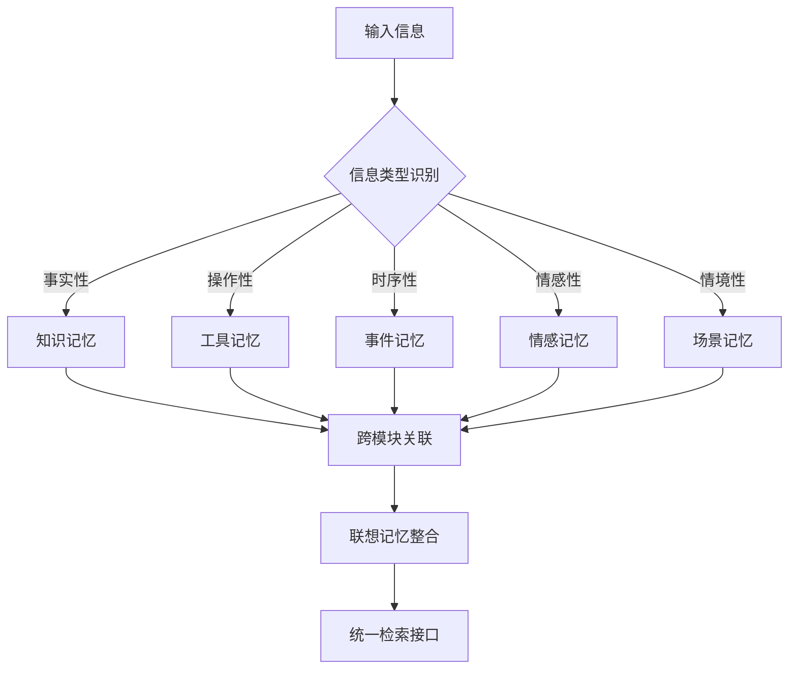

# 记忆模块机制设计核心表格

## 一、记忆模块核心关注点与机制设计

| 记忆模块 | 核心关注内容 | 关键机制设计 | 质量指标 | 存储策略 | 检索机制 |
|----------|--------------|--------------|----------|----------|----------|
| **知识记忆** | 实体属性、概念关系、事实准确性 | • 实体-关系-属性三元组<br>• 概念层次结构<br>• 知识图谱链接<br>• 语义向量化 | • 事实准确率<br>• 概念完整性<br>• 关系一致性<br>• 知识覆盖度 | • RAG模式：完整知识图谱<br>• 混合模式：结构化片段<br>• 压缩模式：概念关系图 | • 语义相似度检索<br>• 图结构遍历<br>• 多跳推理链 |
| **工具记忆** | 功能准确性、参数完整性、调用可靠性 | • 函数签名标准化<br>• 参数类型验证<br>• 调用链追踪<br>• 错误处理机制 | • 调用成功率<br>• 参数准确度<br>• 响应时间<br>• 错误恢复能力 | • RAG模式：完整MCP文档<br>• 混合模式：模板+示例<br>• 压缩模式：签名+核心参数 | • 精确匹配检索<br>• 功能相似度<br>• 使用场景匹配 |
| **事件记忆** | 时序关系、因果链条、情境完整性 | • 时间戳标记<br>• 因果关系建模<br>• 事件链构建<br>• 情境上下文保存 | • 时序准确性<br>• 因果逻辑性<br>• 情境完整度<br>• 事件关联度 | • RAG模式：完整事件序列<br>• 混合模式：关键节点+关系<br>• 压缩模式：事件摘要+因果图 | • 时间范围检索<br>• 因果链追溯<br>• 相似事件匹配 |
| **情感记忆** | 情感状态、情绪变化、情感关联 | • 情感向量编码<br>• 情绪状态机<br>• 情感强度量化<br>• 情感传播模型 | • 情感识别准确率<br>• 情绪变化连续性<br>• 情感关联合理性<br>• 个性化匹配度 | • RAG模式：完整情感轨迹<br>• 混合模式：情感标签+强度<br>• 压缩模式：情感类型+触发词 | • 情感相似度检索<br>• 情绪状态匹配<br>• 情感场景关联 |
| **场景记忆** | 场景语义、上下文完整性、环境特征 | • 场景特征提取<br>• 上下文向量化<br>• 环境状态建模<br>• 场景转换追踪 | • 场景识别准确率<br>• 上下文完整性<br>• 环境特征覆盖<br>• 场景转换合理性 | • RAG模式：完整场景描述<br>• 混合模式：场景模板+参数<br>• 压缩模式：场景类型+关键特征 | • 场景相似度检索<br>• 上下文匹配<br>• 环境特征对比 |
| **程序记忆** | 执行流程、操作序列、技能可复现性 | • 步骤序列化<br>• 条件分支处理<br>• 异常处理流程<br>• 技能组合机制 | • 执行成功率<br>• 流程完整性<br>• 技能可复现性<br>• 组合有效性 | • RAG模式：完整流程文档<br>• 混合模式：关键步骤+决策点<br>• 压缩模式：流程图+核心操作 | • 流程相似度检索<br>• 技能匹配<br>• 操作序列对比 |
| **联想记忆** | 概念关联、创意连接、模式识别 | • 关联强度计算<br>• 扩散激活机制<br>• 模式匹配算法<br>• 创意组合规则 | • 关联合理性<br>• 创意新颖度<br>• 模式识别准确率<br>• 扩散激活效率 | • RAG模式：完整关联网络<br>• 混合模式：关键节点+权重<br>• 压缩模式：核心关联+强度 | • 扩散激活检索<br>• 关联强度排序<br>• 模式相似度匹配 |

## 二、记忆模块的机制设计重点

### 1. 知识记忆：结构化准确性机制
```python
class KnowledgeMemoryMechanism:
    def __init__(self):
        self.entity_extractor = EntityExtractor()
        self.relation_mapper = RelationMapper()
        self.fact_validator = FactValidator()
        self.knowledge_graph = KnowledgeGraph()
    
    def encode_knowledge(self, content):
        # 实体-关系-属性提取
        entities = self.entity_extractor.extract(content)
        relations = self.relation_mapper.map_relations(entities, content)
        
        # 事实验证和一致性检查
        validated_facts = self.fact_validator.validate(entities, relations)
        
        # 知识图谱集成
        return self.knowledge_graph.integrate(validated_facts)
    
    def retrieve_knowledge(self, query):
        # 多跳推理检索
        return self.knowledge_graph.multi_hop_reasoning(query)
```

### 2. 工具记忆：可靠性保证机制
```python
class ToolMemoryMechanism:
    def __init__(self):
        self.signature_parser = SignatureParser()
        self.parameter_validator = ParameterValidator()
        self.execution_tracker = ExecutionTracker()
        self.error_handler = ErrorHandler()
    
    def encode_tool(self, tool_info):
        # 标准化工具签名
        signature = self.signature_parser.parse(tool_info)
        
        # 参数验证规则
        validation_rules = self.parameter_validator.create_rules(signature)
        
        # 执行追踪机制
        return {
            "signature": signature,
            "validation": validation_rules,
            "execution_history": [],
            "error_patterns": []
        }
    
    def retrieve_tool(self, intent):
        # 功能匹配 + 可靠性评分
        return self.match_by_function_and_reliability(intent)
```

### 3. 事件记忆：时序因果机制
```python
class EventMemoryMechanism:
    def __init__(self):
        self.temporal_parser = TemporalParser()
        self.causal_analyzer = CausalAnalyzer()
        self.event_chain_builder = EventChainBuilder()
        self.context_extractor = ContextExtractor()
    
    def encode_event(self, event_data):
        # 时间信息提取
        temporal_info = self.temporal_parser.parse(event_data)
        
        # 因果关系分析
        causal_relations = self.causal_analyzer.analyze(event_data)
        
        # 事件链构建
        event_chain = self.event_chain_builder.build(temporal_info, causal_relations)
        
        # 情境上下文
        context = self.context_extractor.extract(event_data)
        
        return {
            "temporal": temporal_info,
            "causal": causal_relations,
            "chain": event_chain,
            "context": context
        }
```

### 4. 情感记忆：情感状态机制
```python
class EmotionMemoryMechanism:
    def __init__(self):
        self.emotion_detector = EmotionDetector()
        self.emotion_vectorizer = EmotionVectorizer()
        self.emotion_state_machine = EmotionStateMachine()
        self.emotion_propagator = EmotionPropagator()
    
    def encode_emotion(self, content, context):
        # 情感识别和量化
        emotions = self.emotion_detector.detect(content)
        emotion_vector = self.emotion_vectorizer.vectorize(emotions)
        
        # 情感状态转换
        state_transition = self.emotion_state_machine.transition(emotion_vector, context)
        
        # 情感传播建模
        propagation = self.emotion_propagator.model_propagation(emotions, context)
        
        return {
            "emotions": emotions,
            "vector": emotion_vector,
            "state": state_transition,
            "propagation": propagation
        }
```

### 5. 场景记忆：上下文完整性机制
```python
class ScenarioMemoryMechanism:
    def __init__(self):
        self.scene_analyzer = SceneAnalyzer()
        self.context_builder = ContextBuilder()
        self.environment_modeler = EnvironmentModeler()
        self.transition_tracker = TransitionTracker()
    
    def encode_scenario(self, scenario_data):
        # 场景特征分析
        scene_features = self.scene_analyzer.analyze(scenario_data)
        
        # 上下文构建
        context = self.context_builder.build(scene_features)
        
        # 环境建模
        environment = self.environment_modeler.model(scenario_data)
        
        # 场景转换追踪
        transitions = self.transition_tracker.track(scenario_data)
        
        return {
            "features": scene_features,
            "context": context,
            "environment": environment,
            "transitions": transitions
        }
```

## 三、记忆模块协同机制

### 1. 跨模块信息流转


### 2. 质量保证协同机制
- **一致性检查**：跨模块信息的一致性验证
- **完整性补全**：利用其他模块信息补全缺失内容
- **准确性验证**：多模块交叉验证信息准确性
- **时效性更新**：基于事件记忆更新其他模块信息

### 3. 检索协同策略
- **多模块并行检索**：同时从多个模块检索相关信息
- **结果融合排序**：基于不同模块的质量指标进行结果排序
- **上下文增强**：利用场景和情感记忆增强检索结果
- **动态权重调整**：根据查询类型动态调整各模块权重

## 四、配置参数示例

```python
memory_module_config = {
    "knowledge_memory": {
        "focus": "entity_relations",
        "quality_metrics": ["accuracy", "completeness", "consistency"],
        "storage_strategy": "knowledge_graph",
        "retrieval_method": "semantic_reasoning"
    },
    "tool_memory": {
        "focus": "function_reliability",
        "quality_metrics": ["success_rate", "parameter_accuracy", "response_time"],
        "storage_strategy": "mcp_standard",
        "retrieval_method": "exact_match"
    },
    "event_memory": {
        "focus": "temporal_causality",
        "quality_metrics": ["temporal_accuracy", "causal_logic", "context_completeness"],
        "storage_strategy": "event_chain",
        "retrieval_method": "temporal_range"
    },
    "emotion_memory": {
        "focus": "emotional_states",
        "quality_metrics": ["emotion_accuracy", "state_continuity", "association_reasonableness"],
        "storage_strategy": "emotion_vector",
        "retrieval_method": "emotion_similarity"
    },
    "scenario_memory": {
        "focus": "context_semantics",
        "quality_metrics": ["scene_recognition", "context_completeness", "feature_coverage"],
        "storage_strategy": "scene_template",
        "retrieval_method": "context_matching"
    }
}
```

这个表格突出了每个记忆模块的核心机制设计，明确了它们各自的关注重点和质量保证策略，为系统实现提供了清晰的技术指导。 